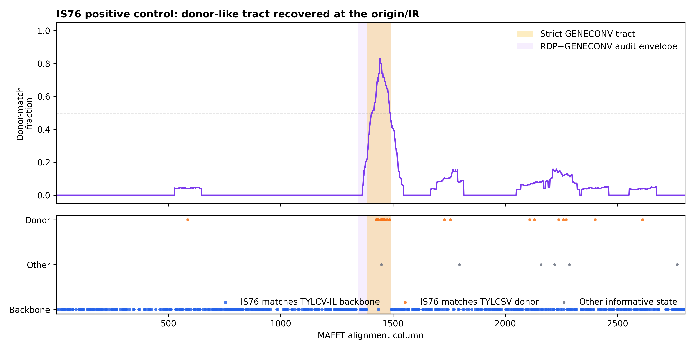
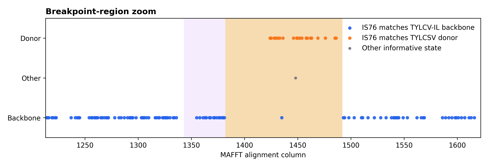
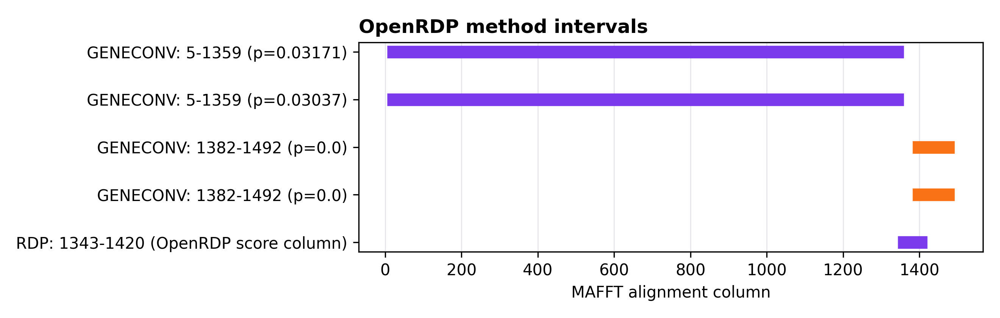
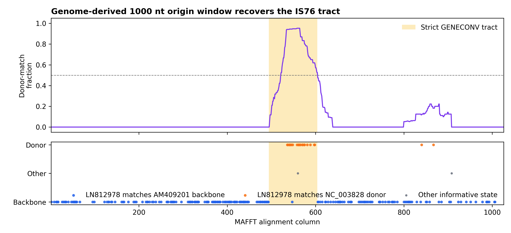

# TYLCV-IS76 Positive-Control Validation

## Result

The SeqScape recombination wrapper recovered the known TYLCV-IS76 resistance-breaking recombinant signal. In the strict screen (`p <= 0.05`), the consensus event resolves:

- recombinant: `IS76_LN812978`
- backbone parent: `TYLCV_IL_AM409201`
- donor parent: `TYLCSV_NC_003828`
- breakpoint interval: alignment columns `1382-1492`
- strict supporting method: `geneconv`
- role support: `628` informative sites

The audit run retains RDP's score-like output and merges it with GENECONV over the same tract envelope (`1343-1492`). This is reported separately because the RDP output column is not a valid probability in this OpenRDP run (`36.36`, greater than 1), while GENECONV gives the strict significant call.

## Input

Input alignment:

`/Users/gerritkoorsen/ciderseq-mono/cideseq-mono/runs/tocsv_260203_full_aws_20260612/full_run/comparators/is76_control_alignment.fasta`

Positive-control metadata:

`/Users/gerritkoorsen/ciderseq-mono/cideseq-mono/runs/tocsv_260203_full_aws_20260612/full_run/comparators/is76_positive_control.json`

|role|id|description|
|---|---|---|
|known recombinant|IS76_LN812978|TYLCV-IS76 isolate G8 (Morocco)|
|backbone parent|TYLCV_IL_AM409201|TYLCV-IL isolate RE4 (Reunion, 2004)|
|donor parent|TYLCSV_NC_003828|TYLCSV reference|

The metadata file records the published TYLCV-IS76 tract as approximately 76 nt. The local control annotation places the recovered signal in the intergenic region immediately downstream of the conserved origin motif, with a reconstructed tract range of 57-103 nt.

## Recombination Calls

|run|recombinant|backbone_parent|donor_parent|methods|breakpoint_columns|min_pvalue|role_support|
|---|---|---|---|---|---|---|---|
|strict p<=0.05|IS76_LN812978|TYLCV_IL_AM409201|TYLCSV_NC_003828|geneconv|1382-1492|0.0|628|
|RDP audit p<=1.0|IS76_LN812978|TYLCV_IL_AM409201|TYLCSV_NC_003828|geneconv,rdp|1343-1492|0.0|628|

All OpenRDP methods completed in the strict run:

|method|strict_status|
|---|---|
|rdp|ok|
|geneconv|ok|
|maxchi|ok|
|chimaera|ok|
|threeseq|ok|
|bootscan|ok|
|siscan|ok|

## Genome-Derived Pipeline Check

To test the practical workflow from comparator genomes, the three positive-control records were extracted from:

`/Users/gerritkoorsen/ciderseq-mono/cideseq-mono/runs/tocsv_260203_full_aws_20260612/full_run/comparators/comparator_panel.fasta`

Origin-centered windows were cut around the conserved `TAATATTAC` motif, aligned with MAFFT, and passed through the same SeqScape recombination wrapper.

|input|records|consensus|recombinant|backbone_parent|donor_parent|methods|breakpoint_columns|min_pvalue|role_support|interpretation|
|---|---|---|---|---|---|---|---|---|---|---|
|400 nt origin window from comparator genomes|3|detected|not resolved|not resolved|not resolved|bootscan,geneconv|100-304|0.0|0|event detected, but the window is too short for flank-based role resolution|
|1000 nt origin window from comparator genomes|3|detected|LN812978|AM409201|NC_003828|geneconv|494-604|0.0|236|event and expected parent roles recovered|

The 400 nt window is sensitive enough to detect the event, but its significant intervals consume most of the window and leave no informative flank support for parent-role polarisation. The 1000 nt origin window resolves the expected roles directly from the extracted genomes: `LN812978` as recombinant, `AM409201` as backbone parent, and `NC_003828` as donor parent.

## Figures



**Figure 1.** Informative-site scan across the aligned TYLCV-IS76 positive control. Blue sites are columns where IS76 matches the TYLCV-IL backbone parent; orange sites are columns where IS76 matches the TYLCSV donor parent. The strict GENECONV tract is shaded yellow. The RDP+GENECONV audit envelope is shaded purple.



**Figure 2.** Zoom around the recovered breakpoint region. The donor-like informative sites concentrate inside the OpenRDP/GENECONV interval, while the flanking sequence returns to the TYLCV-IL backbone state.



**Figure 3.** OpenRDP method intervals in the positive-control run. GENECONV gives the strict significant interval; RDP reports an overlapping interval but its numeric field is score-like rather than a p-value in this run.



**Figure 4.** Informative-site scan for the 1000 nt origin-centered window extracted from the comparator genome FASTA. The donor-like sites concentrate in the strict GENECONV interval, while flanking sites support the TYLCV-IL backbone parent.

## Interpretation

This positive-control test passes. The pipeline detects the known resistance-breaking recombination pattern and assigns the expected roles: IS76 as recombinant, TYLCV-IL as the backbone parent, and TYLCSV as the donor-side parent.

The strict result is intentionally conservative: it promotes the GENECONV-supported event under `p <= 0.05`. The RDP audit supports the same region geometrically, but is not counted as strict statistical support because OpenRDP emits a value outside the probability range for that method in this control.

For full-genome inputs, this validation supports using an origin-centered window with enough flanking sequence for role assignment. A 1000 nt window worked for this positive control; a 400 nt window detected recombination but did not retain enough flanking signal to resolve the parent roles.

Informative-site counts from the alignment:

- donor-matching informative sites: 30
- backbone-matching informative sites: 598
- other informative states: 6
- total informative sites: 634

The `role_support` value is the donor-matching plus backbone-matching count (`628`); the six other informative states are retained in the figure but are not counted as role support.

## Commands

Strict run:

```bash
PATH="/private/tmp/openrdp-validation-venv/bin:$PATH" PYTHONPATH=src \
python -m seqscape.cli recombination \
  --alignment-fasta "/Users/gerritkoorsen/ciderseq-mono/cideseq-mono/runs/tocsv_260203_full_aws_20260612/full_run/comparators/is76_control_alignment.fasta" \
  --methods rdp,geneconv,maxchi,chimaera,threeseq,bootscan,siscan \
  --min-methods 1 \
  --pvalue 0.05 \
  --outdir "/Users/gerritkoorsen/ciderseq-mono/cideseq-mono/seqscape/runs/tylcv_is76_pipeline_validation_20260814/strict_p005"
```

RDP audit run:

```bash
PATH="/private/tmp/openrdp-validation-venv/bin:$PATH" PYTHONPATH=src \
python -m seqscape.cli recombination \
  --alignment-fasta "/Users/gerritkoorsen/ciderseq-mono/cideseq-mono/runs/tocsv_260203_full_aws_20260612/full_run/comparators/is76_control_alignment.fasta" \
  --methods rdp,geneconv,maxchi,chimaera,threeseq,bootscan,siscan \
  --min-methods 1 \
  --pvalue 1.0 \
  --outdir "/Users/gerritkoorsen/ciderseq-mono/cideseq-mono/seqscape/runs/tylcv_is76_pipeline_validation_20260814/rdp_audit_p1"
```

Genome-derived 1000 nt origin-window run:

```bash
python scripts/extract_origin_windows.py \
  --fasta "/Users/gerritkoorsen/ciderseq-mono/cideseq-mono/runs/tocsv_260203_full_aws_20260612/full_run/comparators/comparator_panel.fasta" \
  --ids "/Users/gerritkoorsen/ciderseq-mono/cideseq-mono/seqscape/runs/tylcv_is76_pipeline_validation_20260814/inputs/is76_ids.txt" \
  --window-size 1000 \
  --out-fasta "/Users/gerritkoorsen/ciderseq-mono/cideseq-mono/seqscape/runs/tylcv_is76_pipeline_validation_20260814/from_genomes_1000nt/is76_origin_window_1000nt.fasta" \
  --manifest-tsv "/Users/gerritkoorsen/ciderseq-mono/cideseq-mono/seqscape/runs/tylcv_is76_pipeline_validation_20260814/from_genomes_1000nt/is76_origin_window_1000nt_manifest.tsv"

mafft --auto --thread 8 \
  "/Users/gerritkoorsen/ciderseq-mono/cideseq-mono/seqscape/runs/tylcv_is76_pipeline_validation_20260814/from_genomes_1000nt/is76_origin_window_1000nt.fasta" \
  > "/Users/gerritkoorsen/ciderseq-mono/cideseq-mono/seqscape/runs/tylcv_is76_pipeline_validation_20260814/from_genomes_1000nt/is76_origin_window_1000nt_aligned.fasta"

PATH="/private/tmp/openrdp-validation-venv/bin:$PATH" PYTHONPATH=src \
python -m seqscape.cli recombination \
  --alignment-fasta "/Users/gerritkoorsen/ciderseq-mono/cideseq-mono/seqscape/runs/tylcv_is76_pipeline_validation_20260814/from_genomes_1000nt/is76_origin_window_1000nt_aligned.fasta" \
  --methods rdp,geneconv,maxchi,chimaera,threeseq,bootscan,siscan \
  --min-methods 1 \
  --pvalue 0.05 \
  --outdir "/Users/gerritkoorsen/ciderseq-mono/cideseq-mono/seqscape/runs/tylcv_is76_pipeline_validation_20260814/from_genomes_1000nt/recombination_strict_p005"
```
